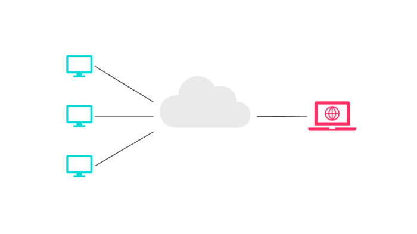
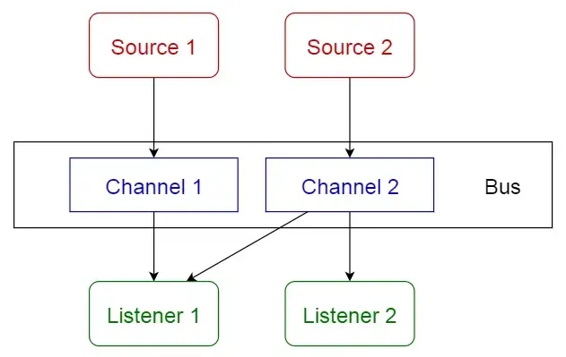

Клиент — сервер

__Контекст__

Есть общие ресурсы и сервисы, к которым нужно обеспечить доступ большого количества распределенных клиентов, и при этом необходимо контролировать доступ или качество обслуживания.

__Задача__
Управляя набором общих ресурсов и сервисов, можно обеспечить модифицируемость и повторное использование, для чего общие сервисы выносятся отдельно, чтобы их можно было изменять в одном месте или в небольшом количестве мест. Требуется улучшить масштабируемость и доступность к использованию за счет централизованного управления этими ресурсами и сервисами при одновременном распределении самих ресурсов между несколькими физическими серверами.

__Решение__
В подходе «клиент — сервер» компоненты и соединительные элементы обладают определенным поведением.

Компоненты, называемые «клиентами», отправляют запросы компоненту, называемому «сервер», и ждут ответа.

Компонент «сервер» получает запрос от клиента и отправляет ему ответ.

__Недостатки__

Сервер может быть узким местом в отношении производительности, а также единой точкой отказа.

Изменять принятое решение о размещении функциональных возможностей (на клиенте или на сервере) после создания системы — это обычно сложно и дорого.

__Применение__
Подход «клиент — сервер» можно применять в моделировании части системы, имеющей много компонентов, отправляющих запросы (это «клиенты») другому компоненту (это «сервер»), который обеспечивает работу сервисов, — например, онлайн-приложения (электронная почта, обмен документами и банковское дело).

__Клиент-серверные технологии__
Архитектура клиент-сервер применяется в большом числе сетевых технологий, используемых для доступа к различным сетевым сервисам. Кратко рассмотрим некоторые типы таких сервисов (и серверов).

- Web-серверы

Изначально представляли доступ к гипертекстовым документам по протоколу HTTP (Huper Text Transfer Protocol). Сейчас поддерживают расширенные возможности, в частности работу с бинарными файлами (изображения, мультимедиа и т.п.).

- Серверы приложений

Предназначены для централизованного решения прикладных задач в некоторой предметной области. Для этого пользователи имеют право запускать серверные программы на исполнение. Использование серверов приложений позволяет снизить требования к конфигурации клиентов и упрощает общее управление сетью.

- Серверы баз данных

Серверы баз данных используются для обработки пользовательских запросов на языке SQL. При этом СУБД находится на сервере, к которому и подключаются клиентские приложения.

- Файл-серверы

Файл-сервер хранит информацию в виде файлов и представляет пользователям доступ к ней. Как правило файл-сервер обеспечивает и определенный уровень защиты от несакционированного доступа.

- Прокси-сервер

Во-первых, действует как посредник, помогая пользователям получить информацию из Интернета и при этом обеспечивая защиту сети.
Во-вторых, сохраняет часто запрашиваемую информацию в кэш-памяти на локальном диске, быстро доставляя ее пользователям без повторного обращения к Интернету.

- Файрволы (брандмауэры)

Межсетевые экраны, анализирующие и фильтрующие проходящий сетевой трафик, с целью обеспечения безопасности сети.

- Почтовые серверы

Представляют услуги по отправке и получению электронных почтовых сообщений.

- Серверы удаленного доступа (RAS)

Эти системы обеспечивают связь с сетью по коммутируемым линиям. Удаленный сотрудник может использовать ресурсы корпоративной ЛВС, подключившись к ней с помощью обычного модема.

Это лишь несколько типов из всего многообразия клиент-серверных технологий, используемых как в локальных, так и в глобальных сетях.

Для доступа к тем или иным сетевам сервисам используются клиенты, возможности которых характеризуются понятием «толщины». Оно определяет конфигурацию оборудования и программное обеспечение, имеющиеся у клиента. Рассмотрим возможные граничные значения:

- «Тонкий» клиент
Этот термин определяет клиента, вычислительных ресурсов которого достаточно лишь для запуска необходимого сетевого приложения через web-интерфейс. Пользовательский интерфейс такого приложения формируется средствами статического HTML (выполнение JavaScript не предусматривается), вся прикладная логика выполняется на сервере.
Для работы тонкого клиента достаточно лишь обеспечить возможность запуска web-браузера, в окне которого и осуществляются все действия. По этой причине web-браузер часто называют "универсальным клиентом".

- «Толстый» клиент
Таковым является рабочая станция или персональный компьютер, работающие под управлением собственной дисковой операционной системы и имеющие необходимый набор программного обеспечения. К сетевым серверам «толстые» клиенты обращаются в основном за дополнительными услугами (например, доступ к web-серверу или корпоративной базе данных).
Так же под «толстым» клиентом подразумевается и клиентское сетевое приложение, запущенное под управлением локальной ОС. Такое приложение совмещает компонент представления данных (графический пользовательский интерфейс ОС) и прикладной компонент (вычислительные мощности клиентского компьютера).

### Трехзвенная архитектура ###

Еще одна тенденция в клиент-серверных технологиях связана со все большим использованием распределенных вычислений. Они реализуются на основе модели сервера приложений, где сетевое приложение разделено на две и более частей, каждая из которых может выполняться на отдельном компьютере. Выделенные части приложения взаимодействуют друг с другом, обмениваясь сообщениями в заранее согласованном формате. В этом случае двухзвенная клиент-серверная архитектура становится трехзвенной (`three-tier, 3-tier`).

Как правило, третьим звеном в трехзвенной архитектуре становится сервер приложений, т.е. компоненты распределяются следующим образом (рис. выше):

Представление данных — на стороне клиента.

Прикладной компонент — на выделенном сервере приложений (как вариант, выполняющем функции промежуточного ПО).

Управление ресурсами — на сервере БД, который и представляет запрашиваемые данные.

Трехзвенная архитектура сложнее, но благодаря тому, что функции распределены между серверами второго и третьего уровня, эта архитектура представляет:

- Высокую степень гибкости и масштабируемости.

- Высокую безопасность (т.к. защиту можно определить для каждого сервиса или уровня).

- Высокую производительность (т.к. задачи распределены между серверами).

### Шина ###
 Этот паттерн в основном имеет дело с событиями и состоит из 4 основных компонентов:
  __источник событий__; 
  __прослушиватель событий__; 
  __канал__; 
  __шина событий__. 
  
  Источники публикуют сообщения в определенные каналы на шине событий. 
  Слушатели подписываются на определенные каналы. 
  Слушатели уведомляются о сообщениях, опубликованных на канале, на который они ранее подписались.
  
  
 
 Применение
 - Android-разработка
 - Службы уведомлений
 
 
 ### Источники ###
 
 https://academy.mediasoft.team/article/patterny-proektirovaniya-dlya-chego-nuzhny-kakimi-byvayut-i-chem-otlichayutsya-ot-arkhitekturnykh/
 
 https://towardsdatascience.com/10-common-software-architectural-patterns-in-a-nutshell-a0b47a1e9013
 
 https://www.4stud.info/networking/lecture5.html
 
 
