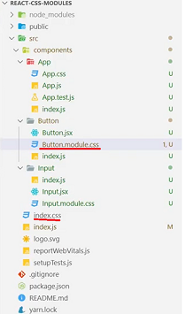

## CSS Modules ##

__`CSS-модули`__ — это `CSS-файлы`, в которых все классы и анимации по умолчанию находятся в локальной области видимости.


?? сборки проекта (например, с помощью Webpack или Browserify), в процессе выполнения которой имена классов и селекторы изменяются так, чтобы образовалась своего рода локальная область видимости (что-то вроде пространства имен).

CSS-модули гарантируют, что все стили одного компонента:
* Находятся в одном месте
* Применяются только к этому компоненту и никакому другому

Кроме того, каждый компонент может иметь настоящие зависимости, например:
```
import buttons from "./buttons.css";
import padding from "./padding.css";

<div class=`${buttons.red} ${padding.large}`>;
```

__ Этот подход был разработан, что бы решить проблему глобальной области видимости в CSS __

#### Ключевое слово `composes` ####

Допустим, есть модуль под названием `type.css`, содержащий стили для текста. В этом файле может быть, например, такое:

```
.serif-font {
  font-family: Georgia, serif;
}

.display {
  composes: serif-font;
  font-size: 30px;
  line-height: 35px;
}
```

Один из этих классов мы используем в шаблоне:

```
import type from "./type.css";

element.innerHTML = 
  `<h1 class="${type.display}">
        Пример заголовка
  </h1>`;
```

В результате получится такая разметка:
```
<h1 class="_type__display_0980340 _type__serif_404840">
    Пример заголовка
</h1>
```
> Оба класса связаны с элементом через использование ключевого слова composes.

можно даже подставлять данные из отдельного CSS-файла:
 ```
 .element {
    composes: dark-red from "./colors.css";
    font-size: 30px;
    line-height: 1.2;
 }
```

#### БЭМ не нужен ####

Нам не нужен БЭМ, если мы используем CSS-модули. По двум причинам:

1) __Простота чтения__. Код вроде `type.display` так же понятен для разработчика, как и `.font-size__serif--large` из БЭМ. Его даже проще читать, чем разросшиеся БЭМ-селекторы.

2) __Локальная область видимости__. 
Допустим, в одном из модулей у нас есть класс `.big` и он увеличивает `font-size` на некоторую величину. 
В другом модуле у нас есть точно такой же класс `.big`, который увеличивает `padding` и `font-size` на другую величину. 
И это не имеет никакого значения! Они не будут конфликтовать, так как у стилей различаются области видимости. 
Даже если модуль импортирует обе таблицы стилей, у классов будет своё уникальное имя, созданное в процессе сборки специально для них.

Другими словами, при использовании CSS-модулей проблемы специфичности селекторов просто исчезают.

### CSS-модули в REACT ###

В `Сreate REact App` встроена [возможность](https://create-react-app.dev/docs/adding-a-css-modules-stylesheet) использования CSS-модулей.

Как правило в папке каждого компонента создается файл с его стилями. Эти файлы принято именовать по примеру: `Button.module.css` (добавляется суффикс 'module').

Какие-либо глобальные стили размещаются обычно в `src/index.css`


__Импорт стилей CSS-модуля__

```
//Button.module.css

.active {
    background-color: maroon;
}
```
Мы импортируем объект, поэтому его необходимо именовать.
```
import from styles './Button.module.css'

console.log(styles);
```


Если создать в другом компоненте css-модуль с таким же классом, получим 2 разных класса с автоматически добавленным хеш-суффикс:


Классы именуются так - `[filename]\_[classname]\_\_[hash]`.

Добавление стиля к компоненту выполняется путем передачи класса (свойства объекта) в параметр `classname`:
<button className={styles.active}>{props}</button>


__Модули также активно применяются с препроцессорами__

Для использования sass/scss в проект необходимо установить: `yarn add node-sass`.
Для установки самого sass: `yarn add sass`
> Можно писать media-апросы прямо внутри объявления класса


### Подробнее о SASS ###

`Sass` - это css препроцессор, позволяющий расширить возможности css путем добавления работы с `переменными`, 
`вложенностью стилей`, `миксинами`, `инлайновыми импортами`, `изолировать нужные стили`. 
Также Sass имеет много других удобных фишек для работы, которые отсутствуют в нативном css.

Файлы стилей должны быть в формате `.scss` (можно использовать формат `.sass`, 
разница заключается только в отсутствии скобок и кавычек).

- Использование переменных в Sass. В препроцессорах переменные обозначаются знаком доллара `$`.
  Пример:
  
``` 
  $app-background-color: rgb(170, 26, 26);
  
  .App-header {
    background-color: $app-background-color;
    min-height: 100vh;
    display: flex;
    flex-direction: column;
    align-items: center;
    justify-content: center;
    font-size: calc(10px + 2vmin);
    color: white;
  }
```
> Для работы с переменными при использовании SCSS частой практикой считается создание файла с переменными (например `var.scss`). Эти переменные будут задействованыв разных `scss-файлах` внутри `react-компонентов`. Далее в этих `scss-файлах` компонентов необходимо импортировать файл с переменными.
>

- __Амперсанд__

В SCSS используется директива `&`.
```
#p {
  color: black;
  a {
    font-weight: bold;
    &:hover {
      color: red;
    }
  }
}
```

С помощью символа `&` вы можете явно указать, где должен быть вставлен родительский селектор.

- __Миксины (они же примеси)__
Миксины объявляются директивой `@mixin`. 
После неё должно стоять имя миксина и, опционально, его параметры, а также блок, содержащий тело миксина. 
Например, можно определить миксин `flexible()`, который далее будет включён, например, в класс `.centered-elements` 
следующим образом:

```
@mixin flexible () {
    display: flex;
    justify-content: center;
    align-items: center;
  }

.centered-elements {
    @include flexible ();
    border: 1px solid gray;
  }
```
Теперь каждый раз после применения класса `.centered-elements` к HTML-элементу, он будет преобразован во Flexbox.

- __Арифметические операции__
Как и в реальной жизни, вы не можете работать с числами, у которых несовместимы типы данных (например, сложение рх и em).
```
p {
    font-size: 10px + 2em;  // ОШИБКА!
    font-size: 10px + 6px;  // 16px
    font-size: 10px + 2;    // 12px
}
div {
    height: 12% - 2%;
    margin: 4rem - 1;
}
```
Умножение выполняется точно так же, как в CSS, с помощью calc(a * b), но без calc и круглых скобок. 
Кроме того, можно ещё отделять знак умножения пробелами от чисел (5*6 == 5 * 6).

> __Исключение!__ Нельзя умножать пиксели между собой. То есть, 10px * 10px != 100px. 10px * 10 == 100px.

Есть три помощника, которые намекнут на возможность __деления__:

-Значение (или любая его часть) хранится в переменной или возвращается функцией.

-Значения заключены в круглые скобки.

-Значение используется как часть другого арифметического выражения.

Пример:
```
$var1: 20;
$var2: 4;

p {
    top: 16px / 24px;          // Отображается без изменений в стандартном CSS
    top: (20px / 5px);         // Производится деление (но только при использовании скобок)
    top: #{$var1} / #{$var2};  // Выводится как обычный CSS-код, деление не выполняется
    top: $var1 / $var2;        // Деление выполняется
    top: random(4) / 5;        // Деление выполняется (если использовать в паре с функцией)
    top: 2px / 4px + 3px;      // Деление выполняется, если добавлена ещё одно арифметическое действие
}
```
- Операторы сравнения
 

Директива `@if` принимает выражение `SassScript` и использует вложенные в неё стили в случае, 
если выражение возвращает любое значение, кроме `false` или `null`.


- __Операторы управления потоками__

В SCSS есть функции (function()) и директивы (@directive).

f()
if() — это функция (и иногда основа искусственного интеллекта).

Её использование выглядит довольно примитивным: оператор вернёт одно из двух обозначенных в условии значений.
```
/* Использование функции if() */
    if (true, 1px, 2px) => 1px;
    if (false, 1px, 2px) => 2px;
```

@if — это директива, использующаяся для разветвления на основе условия.
```
/* Использование директивы @if */
    p {
        @if 1 + 1 == 2 { border: 1px solid;  } // !
        @if 7 < 5      { border: 2px dotted; }
        @if null       { border: 3px double;  }
    }
```

Директива @for
Директива @for выводит набор стилей заданное число раз. Для каждого повторения используется переменная-счётчик для изменения вывода.
```
/// Директива @for итерируется 5 раз.

@for $i from 1 through 5 {
    .definition-#{$i} { width: 10px * $i; }
}
```
Результат компиляции в CSS:
```
.definition-1 { width: 10px; }
.definition-2 { width: 20px; }
.definition-3 { width: 30px; }
.definition-4 { width: 40px; }
.definition-5 { width: 50px; }
```

- __Функции в Sass/SCSS__
Используя Sass/SCSS можно использовать функции так же, как и в других языках.
    
Создадим функцию `three-hundred-px()`, возвращающую 300px.
```
    @function three-hundred-px() {
        @return 300px;
    }
    
    .name {
        width: three-hundred-px();
        border: 1px solid gray;
        display: block;
        position: absolute;
    }
```


#### Добавление сброса CSS __(CSS Reset)__

PostCSS Normalize - помогает обеспечитбь корректную стилизацию на разных браузерах.

Чтобы начать использовать его, добавьте `@import-normalize;` в любом месте 
вашего файла (файлов) CSS. Вам нужно включить его только один раз, и повторяющиеся импорты будут автоматически удалены. 
Хорошим местом для его добавления является `index.css` или `App.css`.
### Источники: ###
https://glenmaddern.com/articles/css-modules

https://create-react-app.dev/

https://webcademy.ru/blog/807/

https://tproger.ru/translations/complete-sass-guide/