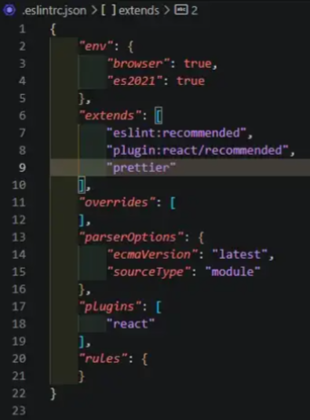
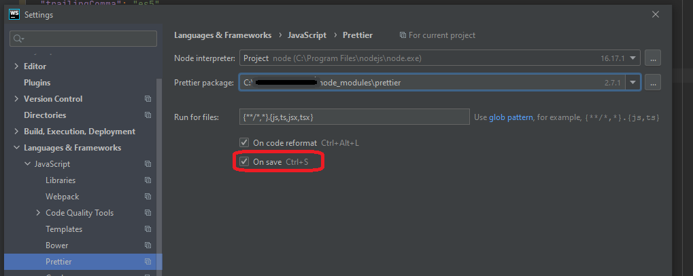
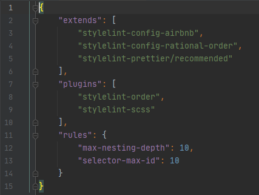

## ESLint ##

Чтобы увидеть ошибки до запуска кода, используется инструмент, который называется `линтер`. 
Для поиска ошибок применяется статический анализ и используются особые правила.

__`ESLint`__ — это инструмент для поиска и исправления ошибок в коде JavaScript и ECMAScript. 
Он находит __синтаксические ошибки, проблемы в шаблонах проектирования и отклонения от стиля__. 
Наряду с большим количеством встроенных правил в нем можно __использовать собственные правила__ или __готовые плагины с правилами__. 
Благодаря модульной структуре и множеству возможностей настройки можно настроить ESLint именно так, 
как нужно для вашего проекта.

То есть он выступает в роли некого помощника по части 'здоровья' кода. 
Мы определяем список правил и в дальнейшем, в `IDE` проверяет, написанный код.
Например, определим переменную, но нигде не используем? 
Сработает правило: ___`no-unused-vars`___ и переменная будет подчеркнута.

> При наведении на подчеркивание в скобочках отображается название правила - не нужно сразу бежать гуглить. 
> Необходимо вставить текст ошибки в поиске на сайте (eslint.org), будет быстрее!


Д.т.ч установить `ESLint` в каталог проекта, необходимо запустить в терминале следующую команду:
```
npm install eslint --save-dev
```

`ESLint` будет установлен локально. 
Существует возможность глобальной установки (с помощью команды `npm install eslint --global`), 
__но не рекомендуется использовать такой подход__. Все модули и совместно используемые файлы конфигурации 
в любом случае следует устанавливать локально.

Для настройки файла конфигурации требуется выполнить следующую команду:
```
npx eslint --init
```

Во время выполнения этой команды вам понадобится ответить на несколько вопросов. 
Предположим, что нам нужно проверять синтаксис, находить проблемы и применять стиль кодирования:


Укажем, что будут использованы модули JavaScript:


Выбираем по необходимости `framework`: 


Отмечаем, используем / не используем TypeScript


Код будет выполняться в браузере:


Указываем, что хотим использовать инструкцию по популярным стилям:


Укажем, что будем применять инструкции по стилю и выберем Airbnb:


Файл конфигурации будет создан в формате JSON:


Установим зависимости:


В результате в каталоге проекта будет создан файл `.eslintrc.json`.

Файл будет иметь подобную структуру:
```
module.exports = {
    'env': {
        'browser': true,
        'es2021': true
    },
    'extends': 'eslint:recommended',
    'parserOptions': {
        'ecmaVersion': 12,
        'sourceType': 'module'
    },
    'rules': {
    }
};
```

Свои правила при необходимости следует добавлять в раздел `rules` файла `.eslintrc.json`. 
> Эти правила в случае пересечения будут иметь наивысший приоритет.


### Пример добавления своих правил ###
```
'rules': {
        'indent': [
            'error',
            4
        ],
        'linebreak-style': [
            'error',
            'unix'
        ],
        'quotes': [
            'error',
            'single'
        ],
        'semi': [
            'error',
            'always'
 ]
    }
```

Слово `indent` — это имя правила. 
Первый элемент в списке обозначает уровень ошибки и может принимать следующие значения:
- `off` или `0` — выключить правило;
- `warn` или `1` — включить правило как предупреждение (не влияет на код выхода);
- `error` или `2` — включить правило как ошибку (с кодом выхода 1).
Второй элемент в этом случае означает __количество пробелов__. Второй аргумент зависит от правила.

Приведенные выше правила указывают, 
что следует ___использовать отступ в четыре пробела___, 
___завершение строк в стиле UNIX___, 
___одинарные кавычки___ 
и ___не пропускать точку с запятой___.

> Полный список правил ESLint можно просмотреть по этой [ссылке](https://eslint.org/docs/latest/rules/).

### Отключение проверки ### 
~~Когда нужно быстро что-то написать и не обязательно правильно.~~

Для __отключения отдельной строки__ ее нужно завершить комментарием:
```
// eslint-disable-line
```

Чтобы отключить проверку для __нескольких__ строк, перед ними следует вставить комментарий 
```/* eslint-disable */```, а после — ```/* eslint-enable */```.


Также можно __отключить одно или несколько конкретных правил__. 
Для этого в комментарии их перечисляют через запятую:

```
/* eslint-disable semi, quotes */
```

### Заключение ###
`ESLint` — эффективный инструмент, который можно настраивать и расширять в соответствии с потребностями разных проектов.

ESLint продолжает активно развиваться и интегрируется со многими средами разрабоки.

Он играет важную роль, поскольку его обширные возможности дают разработчикам возможность сконцентрировать усилия на разработке, 
а не на поиске ошибок и несоответствий стилю.

## PRETTIER ##

[Преттир](https://prettier.io/) - это помощник по части оформления кода. 
Можно писать с пробелами перед именем свойства, кавычками, запятыми в последней строке и тд тп - преттир, 
настроенный на сохранение или на пре-коммит хук - "перетрясет" ваши файлы и оформит их в соответствии с настройками, 
которых у него минимум. 

Для добавления в проект запускаем в терминале: 
```
npm install --save-dev --save-exact prettier
или
yarn add --dev --exact prettier
```

После установки переходим в файл `.eslintrc.JSON` и внутри `«extends»` добавляем «prettier» плагин.



Правила задаются в конфигурационном файле `.prettierrc`. Пример:
{
  "useTabs": false, // не использовать табы 
  "printWidth": 80, // длина строки - 80
  "tabWidth": 4, // длина "таба" - 4 пробела
  "singleQuote": true, // использовать одинарные кавычки - да
  "trailingComma": "es5", // запятая в последней строке - да
  "jsxBracketSameLine": false, // закрывающийся jsx в этой же строке
  "semi": false // точка с запятой - нет
}

В качестве среды разработки я использую WebStorm. 
По умолчанию для автоматического правки кода по правилам `Prettier` следует использовать `Ctrl+Alt+L`.
Для удобства IDE позволяет выполнять автоматические правки при сохранении файла.



## STYLELINT ##

### Установка ###

```
npm install --save-dev stylelint stylelint-config-standard
```

Далее необходимо создайть `.stylelintrc.json` файл конфигурации в корне проекта со следующим содержимым:
```
{
  "extends": "stylelint-config-standard"
}
```

Реальный пример конфига:



Со всеми возможными правилами можно ознакомиться [здесь](https://stylelint.io/user-guide/rules)

###  Источники ###
https://eslint.org/

https://max-frontend.gitbook.io/redux-course-ru-v2/chapter1/eslint-i-prettier

[Сложно о простом: ESLint в команде](https://habr.com/ru/post/322550/)

https://youtu.be/bfyI9yl3qfE

___
https://www.npmjs.com/package/prettier

https://prettier.io/

___

https://habr.com/ru/post/301594/

https://stylelint.io/


