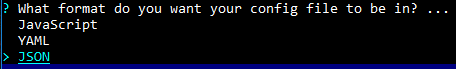

## ESLint и Prettier ##

Чтобы увидеть ошибки до запуска кода, используется инструмент, который называется `линтер`. 
Для поиска ошибок применяется статический анализ и используются особые правила.

__`ESLint`__ — это инструмент для поиска и исправления ошибок в коде JavaScript и ECMAScript. 
Он находит __синтаксические ошибки, проблемы в шаблонах проектирования и отклонения от стиля__. 
Наряду с большим количеством встроенных правил в нем можно __использовать собственные правила__ или __готовые плагины с правилами__. 
Благодаря модульной структуре и множеству возможностей настройки можно настроить ESLint именно так, 
как нужно для вашего проекта.

То есть он выступает в роли некого помощника по части 'здоровья' кода. 
Мы определяем список правил и в дальнейшем, в `IDE` проверяет, написанный код.
Например, определим переменную, но нигде не используем? 
Сработает правило: ___`no-unused-vars`___ и переменная будет подчеркнута.

> При наведении на подчеркивание в скобочках отображается название правила - не нужно сразу бежать гуглить. 
> Необходимо вставить текст ошибки в поиске на сайте (eslint.org), будет быстрее!


Д.т.ч установить `ESLint` в каталог проекта, необходимо запустить в терминале следующую команду:
```
npm install eslint --save-dev
```

`ESLint` будет установлен локально. 
Существует возможность глобальной установки (с помощью команды `npm install eslint --global`), 
__но не рекомендуется использовать такой подход__. Все модули и совместно используемые файлы конфигурации 
в любом случае следует устанавливать локально.

Для настройки файла конфигурации требуется выполнить следующую команду:
```
npx eslint --init
```

Во время выполнения этой команды вам понадобится ответить на несколько вопросов. 
Предположим, что нам нужно проверять синтаксис, находить проблемы и применять стиль кодирования:


Укажем, что будут использованы модули JavaScript:


Выбираем по необходимости `framework`: 


Отмечаем, используем / не используем TypeScript


код будет выполняться в браузере:


Указываем, что хотим использовать инструкцию по популярным стилям:


Укажем, что будем применять инструкции по стилю и выберем Airbnb:


файл конфигурации будет создан в формате JSON:


Установим зависимости:


В результате в каталоге проекта будет создан файл `.eslintrc.json`.

Файл будет иметь подобную структуру:
```
module.exports = {
    'env': {
        'browser': true,
        'es2021': true
    },
    'extends': 'eslint:recommended',
    'parserOptions': {
        'ecmaVersion': 12,
        'sourceType': 'module'
    },
    'rules': {
    }
};
```


###  Источники ###
https://eslint.org/

https://max-frontend.gitbook.io/redux-course-ru-v2/chapter1/eslint-i-prettier

[Сложно о простом: ESLint в команде](https://habr.com/ru/post/322550/)

