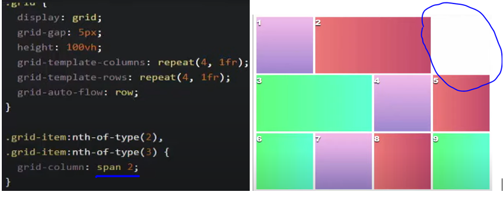

## Flexbox and Grid Layouts ##

***Для чего нужны эти методы разметки?*** - Для компоновки блоков под макет!
> __FlexBox__ - это метод `одномерной` вёрстки для размещения элементов в строках или столбцах. Элементы растягиваются, чтобы заполнить дополнительное пространство и сжимаются, чтобы поместиться в меньшее пространство. 

> __Grid Layout__ - это `двумерная` система вёрстки для веб. Она позволяет размещать контент в строках и столбцах и имеет множество возможностей, которые упрощают построение сложных макетов.
---

## Flexbox ##
Выделяют 2 основные сущности - __flex-container__ и __flex-items__.

Для использования необходимо задать свойство `display` для родительского блока (контейнера).
<pre>section {
    display: flex;
}</pre>

Свойства Flexbox:

| Свойства контейнера | Назначение |
| ------ | ------ |
| Flex-direction | отвечает за расположение основной оси |
| Flex-wrap | разрешает перенос элементов на новый ряд, если в тек-м недостаточно места. |
| Flex-flow | объединяет flex-direction, flex-wrap |
| Gap | задает пустое пространство между элементами |
| Justify-content | выравнивает элементы по основной оси |
| Align-items | выравнивает элементы по поперечной оси |
| Align-content | выравнивание многострочных элементов вдоль поперечной оси |

| Свойства элемента: | Назначение |
| ------ | ------ | 
|Align-self | выравнивание элемента по поперечной оси |
Flex-grow | сколько свободного пространства будет забирать элемент |
Flex-shrink | каким пространством элемент готов поделиться(ужаться)|
Flex-basis | устанавливает размеры элемента|
Flex | Flex-grow, Flex-shrink, Flex-basis; |
Order | определяет порядок элемента. |
---
#### Чуть подробнее... ####

+ #### Flex-direction #### 

Существует 2 оси. По умолчанию  их направление выглядит так:

За расположение основной оси отвечает свойство __`Flex-direction:`__ *`row`*(default) | *`row-reverse`* (справа-налево) | *`column`* | *`column-reverse`*.
>\* __`Min-height:`__ *`100vh`* - *на всю высоту экрана*

+ #### Flex-wrap #### 
>\* По-умолчанию элементы flex не переносятся на новую строку. 

__`Flex-wrap:`__ *`wrap`* (разрешает перенос на новую строку.) | *`no-wrap`* (default) | *`wrap-reverse`* разворачивает поперечную ось на 180 градусов.

+ #### Gap #### 
__`Gap:`__ *`10px;`* - определяет отступы между элементами внутри контейнера

+ #### Flex-flow: ####
Свойство объеденяет в себе `flex-wrap`, `flex-direction`.  

---
### Позиционирование ###

3 свойства для выравнивания контейнера и 1 свойство для выравнивания элементов. 
Применение того или иного свойства зависит от контекста выравнивания.

Для выравнивания элементов вдоль основной оси `(Main axis)` используется свойство __`justify-content`__. 

Для выравнивания вдоль поперечной оси `(Cross axis)` можно воспользоваться свойством __`align-items`__. 

Свойство __`align-content`__ предназначено для выравнивания `flex-элементов` которые распологаются в несколько строк. 

Свойство __`align-self`__ служит для индивидуального выравнивания элемента внутри `flex-контейнера`.

> Если основная ось вертикальная, то необходимо задать высоту.

---
### Изменение размеров ###

### 1)	Использование % ###

### 2)	Пропорции ###
Механизмы распределения размера:

__`Flex-grow`__ – определяет возможность увеличения размера элемента в случае необходимости.

Пример 1 – общий размер возможного расширения для всех элементов. Равные пропорции для распределения свободного пространства.

Пример 2. Здесь 1-ый и 3-ий элементы имеют пропорцию 1, а второй – 2.

__`Flex-shrink`__ - Сколько свободного пространства готов отдать (сжатие) элемент, если соседним элементам не будет хватать места.

Flex-basis – определяет размер элемента до разделения пропорции свободного пространства. При горизонтальном расположении гориз-ой оси св-во задает ширину, а при __`flex-direction:`__ ___`column`___ – высоту (___px, %, rem___ и т.д.). По умолчанию = `auto`.

Для __элементов__ свойство __`flex`__ объединяет = __`flex-grow, flex-shrink, flex-basis`__.

### Задание порядка элементов ###
Свойство __`order`__ применяется к элементу. По умолчанию все элементы __`order: 0;`__

### Возможность вложенности друг в друга. ###
Если внутри flex-элемента есть дочерние элементы (__т.е. он и элемент и контейнер__), в него помимо свойств элемента добавляются св-ва контейнера. __`Display: flex`__.

---
## Grid ##

Задача, которую решает модель CSS3 Grid Layout, очень проста и понятна - предоставить удобный механизм расположения контента по виртуальной сетке. (Создание гибких сеток и манипулирование каждым ее элементом)

Применение сетки к контейнеру. __`Display: grid / inline-grid;`__

__`Grid-template-columns`__ – количество колонок. Может принимать относительные и абсолютные значения. (___`rem, px, min-content, max-content, minmax(100px, 300px)`___, по-умолчанию - ___`auto`___)

Пример: __`Grid-template-columns:`__ ___`100px 1fr 200px;`___ 

__`fr`__ - коэф-т пропорциональности (`фракция`). Колонки подстраиваются под контент.
Дублирование элементов сетки выполняется при помощи значения ___`repeat`___
<pre>
.grid {
    display: grid;
    grid-template-columns: repeat(3, 1fr);
}
</pre>

__`Grid-gap (Grid-column-gap, Grid-row-gap)`__ - Свойство для отступа между элементами.

В отличии от `Flexbox`, `CSS Grid` делит видимую область на ___`колонны`___ и ___`строки`___.
Для определения строк используется свойство __`grid-template-rows`__.

Для управления элемента в колоннах используется __`grid-column-start`__, __`grid-column-end`__, а для строк соответственно __`grid-row-start`__, __`grid-row-end`__. 
В сокращенном виде эти свойства записываются как: 
<pre>
    grid-column: 3 / 4; 
    grid-row: 3 / 4;
</pre> Значения указываются через `/`.

__`Grid-column`__ и __`Grid-row`__ могут быть упрощены в виде __`Grid-area`__. 

Пример:

<pre>grid-area: 1 / 3 / 4 / 4</pre>
__`grid-area:`__ ___`1`___ (grid-row-start) `/` ___`3`___ (grid-column-start) `/` ___`4`___ (grid-row-end) `/` ___`4`___ (grid-column-end).

### Именование grid-линий, создание сетки, позиционирование элементов ###
В свойствах __`Grid-template-rows`__, __`grid-template-columns`__ имена указываются, как `[name]` (в квадратных скобках).

> Использование ключевого слова ___`span`___. 

В дополнение к возможности обращаться к начальной и конечной линии по их номерам вы можете задать номер начальной линии, а после - количество треков, которые должен занять элемент.

<pre>
    .grid-item3 {
        grid-column: col 1 / span 4;
        grid-row: row 3 / row 9;
    }
</pre>

###	Выравнивание grid-элементов (позиционирование контента внутри элементов). ###
К Grid-контейнеру могут быть применены __`Align-items`__, __`justify-items`__. К элементу - __`align-self`__, __`jusify-self`__.

| Сущность | Применяемые свойства |
| --- | --- |
| Block containers /  flex containers / grid containers | Justify-content, Align-content. |
| Grid-контейнер | Align-items, Justify-items. |
| Grid-элемент | Align-self, Justify-self. |

- Выравнивание конкретного элемента контейнера:

По вертикали: __`align-self`__: ___`stretch`___(default), ___`start`___, ___`end`___ , ___`center`___.

По горизонтали: __`justify-self`__: ___`stretch`___(default), ___`start`___, ___`end`___ , ___`center`___.

<pre>
.grid {
    display: grid;
    grid-template-columns: 1fr;
    grid-template-rows: stretch;
}

.grid-item1 {
    align-self: start;
}
</pre>

- Выравнивание элементов контейнера:

По вертикали: __`align-items`__: ___`stretch`___(default), ___`start`___, ___`end`___ , ___`center`___.

По горизонтали: __`justify-items`__: ___`stretch`___(default), ___`start`___, ___`end`___ , ___`center`___.

<pre>
.grid {
    display: grid;
    grid-template-columns: 1fr;
    grid-template-rows: 300px;
    align-items: center;
    justify-items: center;
}
</pre>  

- Выравнивание Grid-контейнера:

По горизонтали: __`justify-content`__: ___`start(def) / end / center / stretch / space-around / space-between  / space-evenly`___.

По вертикали: __`align-content`__: ___`start(def) / end / center / stretch / space-around / space-between  / space-evenly`___.

### Управление порядком элементов внутри grid-контейнера
Элементы размещаются по порядку. Если элементу не хватает места, он переходит в следущий ряд (строку). 
`Grid` позволяет взять алгоритм размещения под свой контроль. 

За алгоритм размещения отвечает свойство __`Grid-auto-flow`__: ___`row (default) / column / … dense`___.

Пример 1
<pre>
.grid {
    display: grid;
    grid-gap: 5px;
    height: 100vh;
    grid-template-columns: repeat(4, 1fr);
    grid-template-rows: repeat(4, 1fr);
    grid-auto-flow: column;
    
}
</pre> 

Пример 2. Если увеличить ширину у 2 и 3 элемента, то возникнут пустоты, т.к. элементы не влезают в 1 строку: 

При использовании значения ___`dense`___ в пустое пространство ‘уйдёт’ ближайший последующий пододящий по размеру элемент (4). 

>___`Dense`___ в `Grid` является __заполнителем свободного пространства__.

Пример 3.

---

- Order

У элементов есть свойство __`order`__: ___`0`___ (по-умолчанию). 

Изменив свойство у конкретного элемента можно перемещать его в начало или конец.

### Вложенность в Grid

Возможность вкладывать контейнеры друг в друга позволяет создавать более сложные структуры.

### Гибкость GRID-элементов при изменении размеров экрана. 
___`auto-fill`___  - вместо того, чтобы указывать количество колонок и сколько раз им повторяться, мы просто можем сказать браузеру, чтобы он уместил как можно больше колонок с учетом указанной длины.
___`auto-fill`___, как бы говорит “я автоматически заполню строку таким количеством колонок, как это возможно с учетом заданной ширины”. 

___`auto-fill`___ используется в связке с repeat() таким образом:

<pre>grid-template-columns: repeat(auto-fill, 100px);</pre>

- minxmax()
 
___`minxmax()`___ - функция в CSS, которую очень удобно использовать в связке с auto-fill. Она позволяет вам указывать минимальное и максимальное значение одновременно.

- auto-fit. 

если элементы в строку и выставить максимальную ширину колонок на 1fr, то браузер разделит оставшееся место поровну между ними, __НЕ ДОБАВЛЯЯ ПУСТЫХ ЭЛЕМЕНТОВ__.
<pre>
grid-template-columns: repeat(auto-fill, minmax(100px, 1fr));
</pre>

###Источники
https://developer.mozilla.org/ru/docs/Learn/CSS/CSS_layout

https://youtu.be/XXlw7TUxRVY

https://habr.com/ru/post/467049/

https://html5book.ru/css3-flexbox/

https://www.w3schools.com/css/css3_flexbox.asp

