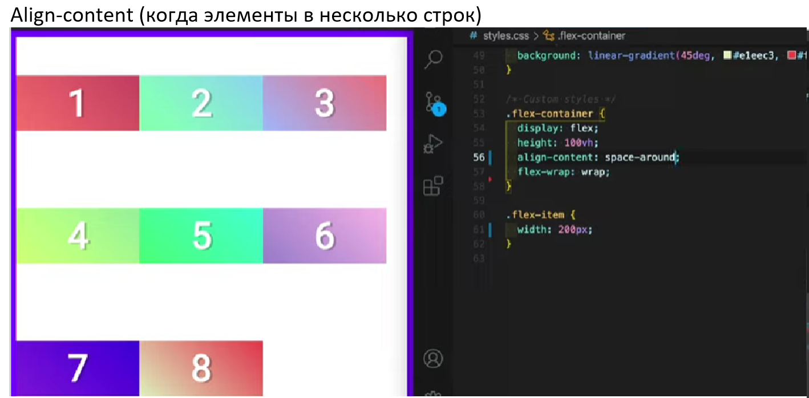

## Flexbox and Grid Layouts ##

***Для чего нужны эти методы разметки?*** - Для компоновки блоков под макет!
> __FlexBox__ - это метод `одномерной` вёрстки для размещения элементов в строках или столбцах. Элементы растягиваются, чтобы заполнить дополнительное пространство и сжимаются, чтобы поместиться в меньшее пространство. 

> __Grid Layout__ - это `двумерная` система вёрстки для веб. Она позволяет размещать контент в строках и столбцах и имеет множество возможностей, которые упрощают построение сложных макетов.
---

## Flexbox ##
Выделяют 2 основные сущности - __flex-container__ и __flex-items__.

Для использования необходимо задать свойство `display` для родительского блока (контейнера).
<pre>section {
    display: flex;
}</pre>

Свойства Flexbox:

| Свойства контейнера | Назначение |
| ------ | ------ |
| Flex-direction | отвечает за расположение основной оси |
| Flex-wrap | разрешает перенос элементов на новый ряд, если в тек-м недостаточно места. |
| Flex-flow | объединяет flex-direction, flex-wrap |
| Gap | задает пустое пространство между элементами |
| Justify-content | выравнивает элементы по основной оси |
| Align-items | выравнивает элементы по поперечной оси |
| Align-content | выравнивание многострочных элементов вдоль поперечной оси |

| Свойства элемента: | Назначение |
| ------ | ------ | 
|Align-self | выравнивание элемента по поперечной оси |
Flex-grow | сколько свободного пространства будет забирать элемент |
Flex-shrink | каким пространством элемент готов поделиться(ужаться)|
Flex-basis | устанавливает размеры элемента|
Flex | Flex-grow, Flex-shrink, Flex-basis; |
Order | определяет порядок элемента. |
---
#### Чуть подробнее... ####

+ #### Flex-direction #### 

Существует 2 оси. По умолчанию  их направление выглядит так:

За расположение основной оси отвечает свойство __`Flex-direction:`__ *`row`*(default) | *`row-reverse`* (справа-налево) | *`column`* | *`column-reverse`*.
>\* __`Min-height:`__ *`100vh`* - *на всю высоту экрана*

+ #### Flex-wrap #### 
>\* По-умолчанию элементы flex не переносятся на новую строку. 

__`Flex-wrap:`__ *`wrap`* (разрешает перенос на новую строку.) | *`no-wrap`* (default) | *`wrap-reverse`* разворачивает поперечную ось на 180 градусов.

+ #### Gap #### 
__`Gap:`__ *`10px;`* - определяет отступы между элементами внутри контейнера

+ #### Flex-flow: ####
Свойство объеденяет в себе `flex-wrap`, `flex-direction`.  

---
### Позиционирование ###

3 свойства для выравнивания контейнера и 1 свойство для выравнивания элементов. 
Применение того или иного свойства зависит от контекста выравнивания.

Для выравнивания элементов вдоль основной оси `(Main axis)` используется свойство __`justify-content`__. 

Для выравнивания вдоль поперечной оси `(Cross axis)` можно воспользоваться свойством __`align-items`__. 

Свойство __`align-content`__ предназначено для выравнивания `flex-элементов` которые распологаются в несколько строк. 

Свойство __`align-self`__ служит для индивидуального выравнивания элемента внутри `flex-контейнера`.

> Если основная ось вертикальная, то необходимо задать высоту.

---
### Изменение размеров ###

### 1)	Использование % ###

##
## Grid ##
Здесь про grid...
###Источники
https://developer.mozilla.org/ru/docs/Learn/CSS/CSS_layout

