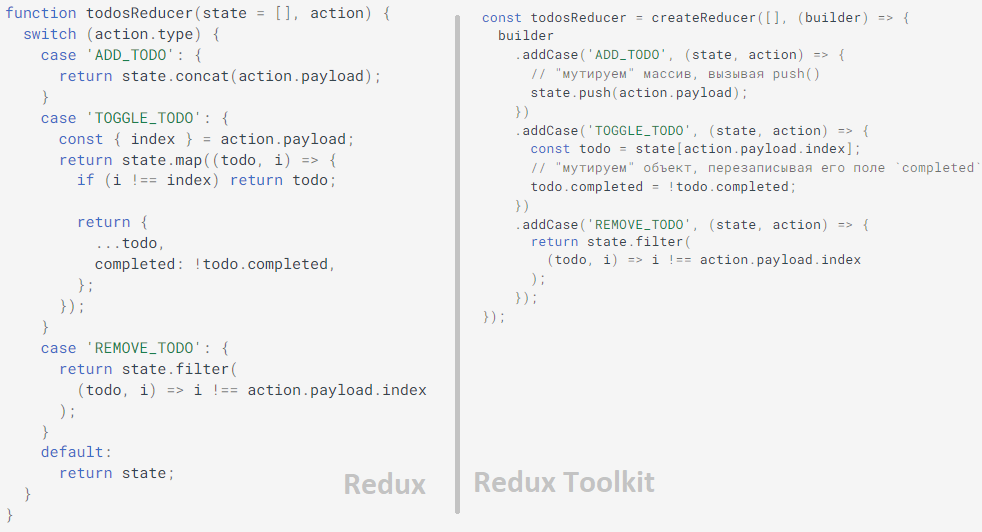

## Redux Toolkit ##

__`Redux Toolkit`__ - это пакет, облегчающий работу с `Redux`. 
Он был разработан для решения трех главных проблем:
- Слишком сложная настройка хранилища (store)
- Для того, чтобы заставить Redux делать что-то полезное, приходится использовать дополнительные пакеты
- Слишком много шаблонного кода (boilerplate)

__`Redux Toolkit`__ предоставляет инструменты для настройки хранилища и выполнения наиболее распространенных операций, 
а также содержит полезные утилиты, позволяющие упростить код.


### Установка ###

Создание нового приложения с помощью Create React App

<pre>
yarn create react-app myApp --template redux
npx create-react-app myApp --template redux
</pre>

#### TypeScript ####

<pre>
yarn create react-app app-name --template redux-typescript
npx create-react-app app-name --templae redux-typescript
</pre>

#### Добавление пакета в существующее приложение ####

<pre>
yarn add @reduxjs/toolkit
npm i @reduxjs/toolkit
</pre>


### Состав пакета Redux Toolkit:

Redux Toolkit включает в себя следующие API:

- __`configureStore()`__: обертка для createStore(), упрощающая настройку хранилища с настройками по умолчанию. Позволяет автоматически комбинировать отдельные частичные редьюсеры (___`slice reducers`___), добавлять промежуточные слои или посредников (___`middlewares`___), по умолчанию включает ___`redux-thunk`___, позволяет использовать расширение __`Redux DevTools`__ (инструменты разработчика Redux) из коробки.

Простым примером создания и настройки хранилища является передача в __`configureStore()`__ корневого редьюсера в качестве аргумента свойства __`reducer`__:

```
import { configureStore } from '@reduxjs/toolkit';
import rootReducer from './reducers';

const store = configureStore({
    reducer: rootReducer,
});

export default store;
```
либо в виде объекта с отдельными редьюсерами:
```
import postsReducer from './postsReducer';
import commentsReducer from './commentsReducer';


const store = configureStore({
    reducer: {
        posts: postsReducer,    
        comments: commentsReducer,
    },
});
```
> ___В этом случае `configureStore()` автоматически вызывает `combineReducers()`___.

- __`createReducer()`__: позволяет в __`reducers`__ вместо инструкций switch-case, напрямую изменять иммутабельный код, например, так: state.todos[3].completed = true. (За счет использования библиотека ___`immer`___).
Редьюсеры - ключевая часть Redux. Как правило, редьюсер отвечает за:
    - __Определение характера ответа__ на основе поля ___`type`___ объекта `action`.
    - __Обновление состояния__ путем копирования части состояния и модификации этой копии.
Хотя в редьюсере можно использовать любую условную логику, наиболее распространенным и простым способом является использование `switch`. 
В документации по Redux приводится [пример создания функции, выступающей в роли поисковой таблицы на основе `action.type`](https://redux.js.org/usage/reducing-boilerplate#generating-reducers).

В классическом Redux есть проблема при написании редьюсеров - необходимость "иммутабельного" обновления состояния.
Функция createReducer() похожа на функцию создания поисковой таблицы из документации по Redux.
Но в ней используется библиотека __`immer`__, что позволяет писать "мутирующий" код, обновляющий состояние __иммутабельно__. Это защищает от непреднамеренного мутирования состояния в редьюсере.

✨M Пример разницы создани редьюсера между Redux и Redux Toolkit:


- __`createAction()`__: генерирует __`action creator`__ для переданного типа операции.

Написание __`action creator`__-ов вручную может быть утомительным. 
Redux Toolkit предоставляет функцию `createAction()`, которая генерирует `action` операции с указанным типом операции и преобразует переданные аргументы в поле `payload`:
```
const addTodo = createAction('ADD_TODO');
addTodo({ text: 'Buy milk' });

// { type : "ADD_TODO", payload : {text : "Buy milk"}} )
```
__Использование __`creator`__-ов в качестве типов операции (action types)__ 
Для определения того, как должно быть обновлено состояние, редюсеры полагаются на тип операции (`action.type`). 
Обычно, это делается посредством раздельного определения типов и создателей операции. 
__`CreateAction()`__ позволяет упростить данный процесс.

1) __`createAction()`__ перезаписывает метод `toString()` генерируемых __`creator`__-ов. 
Это означает, что __`creator`__ может использоваться в качестве ссылки на "тип операции", 
например, в ключах, передаваемых в `builder.addCase()` или `createReducer()`.
2) Тип операции также определяется, как поле type __`creator`__-а.
```
const actionCreator = createAction('SOME_ACTION_TYPE');

console.log(actionCreator.toString());
// SOME_ACTION_TYPE

console.log(actionCreator.type);
// SOME_ACTION_TYPE
```
 
```
const reducer = createReducer({}, (builder) => {
  // Здесь будет автоматически вызван `actionCreator.toString()`
  // Кроме того, при использовании TypeScript, будет правильно предложен (предположен) тип операции
    builder.addCase(actionCreator, (state, action) => {});

  // Или можно указать поле `type`:
    builder.addCase(
        actionCreator.type,
        (state, action) => {}
    );
});
```

Это означает, что нам не нужно создавать отдельную переменную для типа операции или дублировать название и значение типа, 
например: const SOME_ACTION_TYPE = 'SOME_ACTION_TYPE'.

- __`createSlice()`__: метод, который принимает объект, содержащий: редьюсер, название части состояния (state slice), 
начальное значение состояния, и автоматически генерирует частичный редьюсер с соответствующими 
__`action creator`__-ми и типами операции.

В `Redux` состояние, обычно, делится на "части", определяемые редьюсерами, передаваемыми в `combineReducers()`

`createSlice()` автоматически генерирует типы и `action creators` на основе переданного названия редьюсера:
```
const postsSlice = createSlice({
  name: 'posts',
  initialState: [],
  reducers: {
    createPost(state, action) {},
    updatePost(state, action) {},
    deletePost(state, action) {},
  },
});

console.log(postsSlice);
/*
{
  name: 'posts',
  actions : {
      createPost,
      updatePost,
      deletePost,
  },
  reducer
}
*/

const { createPost } = postsSlice.actions;

console.log(
  createPost({ id: 123, title: 'Hello world!' })
);
// { type : 'posts/createPost', payload : { id : 123, title : 'Hello world!' } }
```

createSlice() анализирует функции, определенные в поле reducers, создает редуктор для каждого случая и генерирует создателя, 
использующего название редуктора в качестве типа операции. 
Таким образом, редуктор createPost становится типом операции `posts/createPost`, а creator `createPost()` 
возвращает операцию с этим типом.

__Существует несколько посредников для реализации асинхронности в `Redux`.__ 
Рекомендуемым является [Redux Thunk](https://github.com/reduxjs/redux-thunk). Он прекрасно подходит для большинства случаев, а использование синтаксиса async/await делает его еще лучше.

> `configureStore()` устанавливает thunk автоматически.

- __`createAsyncThunk()`__: принимает тип операции и `функцию, возвращающую промис`, и генерирует thunk, отправляющий типы операции pending/fulfilled/rejected на основе промиса.
- __`createEntityAdapter()`__: генерирует набор переиспользуемых редьюсеров и селекторов для управления нормализованными данными в хранилище.
- __`createSelector()`__: утилита из библиотеки Reselect.


## RTK query ##
__`RTK Query`__ — это функция из Redux, включенная в библиотеку `Redux Toolkit` для упрощения выполнения API-запросов 
и обработки кэширования. RTK Query стремится полностью заменить `thunks` для выполнения `API`-запросов.

`RTK Query` представляет новый API под названием __`createApi`__, который можно использовать для создания необходимых функций 
для выполнения запросов и обработки кэширования. Он включает в себя функции, такие, как аннулирование кэша, 
предварительная выборка, разделение кода и т.д.

Он написан для работы с React из коробки, поскольку создает хуки, которые могут быть использованы непосредственно 
в компонентах для выполнения запросов.

Функция __`createApi`__ имеет следущие опции:
- __reducerPath__ - ___указывается ключ, который будет определять текущий сервис___.
- __tagTypes__ - указываются тэги для правильной работы кэширования.
- __baseQuery__ - ___указывается базовый `URL`___.
- __endpoints__ - ___указываются все Endpoints на которые будут отправляться запросы___. 
В каждом endpoint мы вызываем один из методов ___`build.query / build.mutation`___. 
`Query` используется для __`GET-запросов`__, `Mutation` для остальных `(PUT, POST, DELETE и т.д.)`. 
Метод в свою очередь будет возвращать объект, в нем в свойстве `url` мы указываем путь, 
который 'склеивается' с базовым `URL` (baseURL).

```
export const postAPI = createApi({
    reducerPath: 'postAPI',
    baseQuery: fetchBaseQuery({baseUrl: 'http://localhost:5000'}),
    tagTypes: ['Posts'],
    endpoints: (build) => ({
        fetchAllPosts: build.query<IPost[], number>({
            query: (limit: number = 5) => ({
                url: `/posts`,
                params: {
                    _limit: limit
                }
            }),
            providesTags: result => ['Posts']
        })
```

На основе `endpoints` автоматически формируются хуки, которые будут использоваться для запросов данных. 
Запрос возвращает объект, состоящий из свойств:
- __`data`__ - Последний возвращенный результат независимо от аргумента хука, если он присутствует.
- __`currentData`__ - Последний возвращенный результат для текущего аргумента хука, если он присутствует.
- __`error`__ - Результат ошибки, если он присутствует.
- __`isUninitialized`__ - Значение true указывает, что запрос еще не запущен.
- __`isLoading`__ - Значение true указывает, что запрос в данный момент загружается в первый раз и еще не имеет данных. 
Это будет true для первого запроса, но не для последующих запросов.
- __`isFetching`__ - Значение true указывает, что запрос в настоящее время извлекается, 
но может содержать данные из более раннего запроса. 
Это будет как true для первого запроса, так и для последующих запросов.
- __`isSuccess`__ - Значение true указывает, что запрос содержит данные из успешного запроса.
- __`isError`__ - Значение true указывает, что запрос находится в состоянии ошибки.
- __`refetch`__- Функция принудительного обновления запроса

> Хуки позволяют не запрашивать ранее запрошенные данные, они будут браться из хранилища (КЭШ).
   
Рассмотрим, как необходимо создавать `endpoint` для добавления данных:
```
...
createPost: build.mutation<IPost, IPost>({
            query: (post) => ({
                url: `/posts`,
                method: 'POST',
                body: post
            }),
            invalidatesTags: ['Posts']
        }),
```
В дженерике указывается тип объекта который нам вернется и тип передаваемого аргумента. 
`method` стоит указывать во всех типах запросов, кроме `GET`, так как это значение идет по-умолчанию.

Для того чтобы после добавления данных они отрисовывались в актуальном виде необходимо организовать работу с тэгами.
При получении данных (в`GET`-запросе) указывается свойство `providesTags` - этот `endpoint` обеспечивает доставку данных,
а при создании данных (поста) необходимо указывать, что данные становятся неактуальными при помощи свойства `invalidatesTags`.
И тогда после отправки новых данных будет автоматически инициироваться запрос на получении данных. 
```
//GET
...
providesTags: result => ['Posts'],

//POST
...
invalidatesTags: [Posts]
```
### Дополнительно ###

Для того чтобы например использовать данные из нескольких запросов в одном компоненте 
(исключить пересечение данных), их можно именовать, указав значение через `:` 
```
const {data: posts} =  postAPI.useFetchAllPostsQuery(limit)
const {data: comments} =  postAPI.useFetchAllCommentsQuery('')
```

Генерируемые хуки из перечисленных `endpoints` ожидают два параметра: `(queryArg?, queryOptions?)`.

Параметр `queryArg` будет передан обратному вызову запроса.

Объект `queryOptions` принимает несколько дополнительных параметров, которые можно использовать для управления поведением выборки данных:

- __`pollingInterval`__ Есть возможность реализовать `long polling` (аналог `websocket`) путем передачи в хук параметра со значением времени.
В этом случие данные будут запрашиваться с промежутком в указанный интервал (возможно применимо для чатов, уведомлений):
```
const {data: posts, error, isLoading, refetch} =  postAPI.useFetchAllPostsQuery(limit, {
    pollingInterval: 10000
})
```

- __`Skip`__. `RTK Query` предоставляет возможность условного пропуска запросов
из автоматического запуска с использованием параметра `skip`,  
как части параметров перехватчика запроса.

- __`refetchOnReconnect`__  — позволяет принудительно выполнить повторную загрузку 
запроса при восстановлении сетевого подключения. По умолчанию `false`.

```
 const { data } = useGetPostQuery(id, { skip: !id })
```


---
### Источники: ###
https://redux-toolkit.js.org/

https://github.com/reduxjs/cra-template-redux-typescript

https://reactdev.ru/libs/redux-toolkit/

https://github.com/reduxjs/redux-thunk

---
https://redux-toolkit.js.org/rtk-query/overview

https://youtu.be/Od5H_CiU2vM

https://youtu.be/uSwe-5dPrV8

https://habr.com/ru/post/672144/
