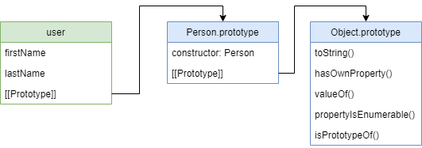
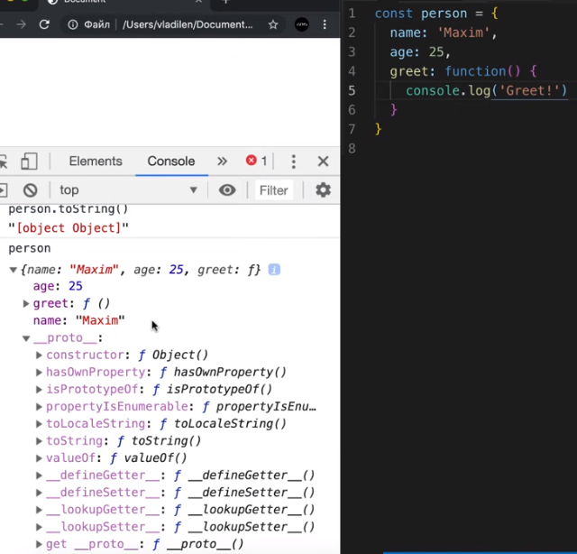
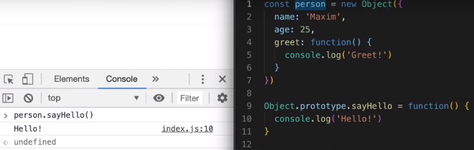

## Синтаксис JS ##

### Типы данных ###
В JavaScript есть __8__ основных типов данных.

Семь из них называют «примитивными» типами данных:
- `number` для любых чисел: целочисленных или чисел с плавающей точкой; целочисленные значения ограничены диапазоном ±(253-1).

- `bigint` для целых чисел произвольной длины.

- `string` для строк. Строка может содержать ноль или больше символов, нет отдельного символьного типа.

- `boolean` для true/false.

- `null` для неизвестных значений – отдельный тип, имеющий одно значение `null`.

- `undefined` для неприсвоенных значений – отдельный тип, имеющий одно значение `undefined`.

- `symbol` для уникальных идентификаторов.

И один не является «примитивным» и стоит особняком:
- `object` для более сложных структур данных.

### Области видимости ###

Не все переменные одинаково доступны — всё зависит от того, в каком месте кода их объявили.

__Область видимости__ — это часть программы, в которой мы можем обратиться к переменной, функции или объекту. 
Этой частью может быть функция, блок или вся программа в целом — то есть мы всегда находимся как минимум в одной области видимости.

Области видимости можно представить как коробки, в которые мы кладём переменные. 
Переменные, которые лежат в одной коробке, могут общаться друг с другом.


Переменные также могут получить доступ к переменным из коробки, в которую вложена их коробка.


__Глобальная область видимости__

Глобальная область видимости — это самая внешняя коробка из всех. 
Когда мы «просто объявляем переменную», вне функций, вне модулей, то эта переменная попадает в глобальную область видимости.

`JS` в браузерах так устроен, что глобальные переменные попадают в объект `window`. 
Если очень грубо, то можно сказать, что `window` в случае браузера — это и есть глобальная область видимости.

__Блочная область видимости__

Блочная область видимости ограничена программным блоком, обозначенным при помощи { и }. 
Простейший пример такой области — это выражение внутри скобок:

```
const a = 42
console.log(a)
// 42

if (true) {
  const b = 43
  console.log(a)
  // 42
  console.log(b)
  // 43
}

console.log(b)
// ReferenceError: Can't find variable: b
```

Контролируемое сокрытие доступа с помощью области видимости называется __замыканием__.


### Прототипы ###

__Прототипы__ - это механизм, с помощью которого объекты JavaScript наследуют свойства друг от друга.

Каждый `объект`, имеет `объект-прототип`, который выступает как `шаблон`, от которого объект `наследует методы и свойства`. 
Объект-прототип так же может иметь свой прототип и наследовать его свойства и методы и т.д. 
Это часто называется `цепочкой прототипов` и объясняет почему одним объектам доступны свойства и методы которые определены в других объектах.

Точнее, свойства и методы определяются в свойстве `prototype` функции-конструктора объектов, а не в самих объектах.

У всех прототипов имеются два общих свойства, `constructor` и `__proto__`. 
Свойство `constructor` указывает на функцию-конструктор, с помощью которой создавался объект, 
а свойство `__proto__` указывает на следующий прототип в цепочке (либо null, если это последний прототип). Остальные свойства доступны через `.`.

В JavaScript создаётся связь между экземпляром объекта и его прототипом (свойство `__proto__`, 
которое является производным от свойства `prototype` конструктора), а свойства и методы обнаруживаются при переходе по цепочке прототипов.



Пример:

Создали объект и видим его свойства.
`__proto__` - ссылка на прототип объекта. В данном случае Object.
То есть в объекте доступны методы и свойства прототипа напрямую.

Для наглядности можно определить новый метод у прототипа и видно, что он доступен у Объекта созданного на основе этого прототипа напрямую. То есть нам не нужно идти вручную по цепочке прототипов.


Если создать объект на основе объекта, то родительский объект будет его прототипом. А прототипом родительского объекта будет `Object`.


Для данного объекта доступны все методы и свойства по цепочке сверху вниз. То есть если определенный метод есть у объекта, то он и будет вызван. Если у объекта нет данного свойства, то JS будет спускаться в его прототип и доставать свойства на этом уровне и т.д. до `Object`. 


### События ###

Событие – это сигнал от браузера о том, что что-то произошло. 
Все DOM-узлы подают такие сигналы (хотя события бывают и не только в DOM).

Вот список самых часто используемых DOM-событий:

__События мыши:__

`click` – происходит, когда кликнули на элемент левой кнопкой мыши (на устройствах с сенсорными экранами оно происходит при касании).
`contextmenu` – происходит, когда кликнули на элемент правой кнопкой мыши.
`mouseover / mouseout` – когда мышь наводится на / покидает элемент.
`mousedown / mouseup` – когда нажали / отжали кнопку мыши на элементе.
`mousemove` – при движении мыши.

__События на элементах управления:__

`submit` – пользователь отправил форму <form>.
`focus` – пользователь фокусируется на элементе, например нажимает на <input>.

__События клавиатуры:__

`keydown` / `keyup` – когда пользователь нажимает / отпускает клавишу.

__События документа:__

`DOMContentLoaded` – когда HTML загружен и обработан, DOM документа полностью построен и доступен.

__CSS events:__

`transitionend` – когда CSS-анимация завершена.

- #### Обработчики событий ####
Событию можно назначить `обработчик`, то есть `функцию`, которая сработает, как только событие произошло.

Именно благодаря обработчикам JavaScript-код может реагировать на действия пользователя.

Есть несколько способов назначить событию обработчик.

- Использование атрибута HTML
Обработчик может быть назначен прямо в разметке, в атрибуте, который называется `on<событие>`.

Например, чтобы назначить обработчик события `click` на элементе `input`, можно использовать атрибут `onclick`.
```
<input type="button" onclick="alert('Клик!')" value="Кнопка">
```

- Использование свойства DOM-объекта
Можно назначать обработчик, используя свойство DOM-элемента `on<событие>`.
```
<input type="button" id="button" value="Кнопка">
<script>
    button.onclick = function() {
        alert('Клик!');
  };
</script>
```

- Доступ к элементу через `this`

Внутри обработчика события `this` ссылается на текущий элемент, то есть на тот, на котором, 
как говорят, «висит» (т.е. назначен) обработчик.

```
<button onclick="alert(this.innerHTML)">Нажми меня</button>
```

- addEventListener
Yедостаток описанных выше способов назначения обработчика – невозможность повесить несколько обработчиков на одно событие.

Например, одна часть кода хочет при клике на кнопку делать её подсвеченной, а другая – выдавать сообщение.

Метод addEventListener позволяет добавлять несколько обработчиков на одно событие одного элемента, например:
```
<input id="elem" type="button" value="Нажми меня"/>

<sсript>
  function handler1() {
    alert('Спасибо!');
  };

  function handler2() {
    alert('Спасибо ещё раз!');
  }

  elem.onclick = () => alert("Привет");
  elem.addEventListener("click", handler1); // Спасибо!
  elem.addEventListener("click", handler2); // Спасибо ещё раз!
</sсript>
```

> Обработчики некоторых событий можно назначать только через addEventListener.

#### Объект события ####
Чтобы хорошо обработать событие, могут понадобиться детали того, что произошло. Не просто «клик» или «нажатие клавиши», а также – какие координаты указателя мыши, какая клавиша нажата и так далее.
     
Когда происходит событие, браузер создаёт объект события, записывает в него детали и передаёт его в качестве аргумента функции-обработчику.
     
Пример ниже демонстрирует получение координат мыши из объекта события:
 ```
 <input type="button" value="Нажми меня" id="elem">
 
 <script>
    elem.onclick = function(event) {
        // вывести тип события, элемент и координаты клика
        alert(event.type + " на " + event.currentTarget);
        alert("Координаты: " + event.clientX + ":" + event.clientY);
   };
 </script>
 ```

Некоторые свойства объекта event:

`event.type` - тип события, в данном случае "click".

`event.currentTarget` - элемент, на котором сработал обработчик.

`event.target` - элемент, в котором изначально произошло событие, в отличие от свойства `currentTarget`, которое всегда ссылается на элемент, прослушиватель событий которого инициировал событие.      

`evevnt.stopPropagation` - Прекращаает дальнейшую передачу текущего события. 
Если есть слушатель на такое же события у родительского элемента, то при всплытии события будет вызваться событие у родителей. 
Этот метод прекращает передачу события на 'родителей'. 

### Источники ###

https://learn.javascript.ru/types

https://doka.guide/js/closures/

https://developer.mozilla.org/ru/docs/Learn/JavaScript/Objects/Object_prototypes

https://habr.com/ru/post/518360/

https://youtu.be/aQkgUUmUJy4